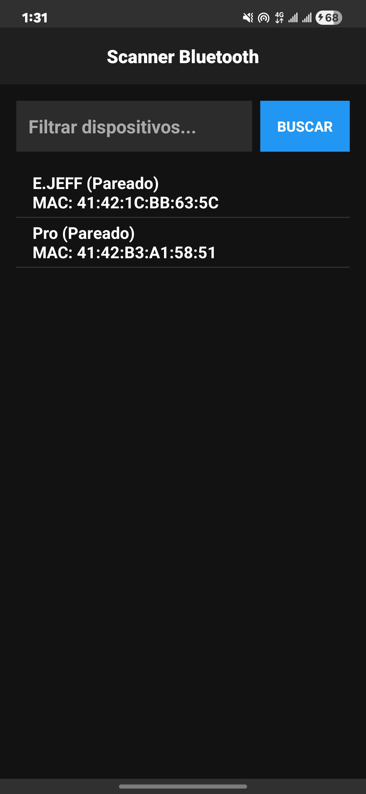
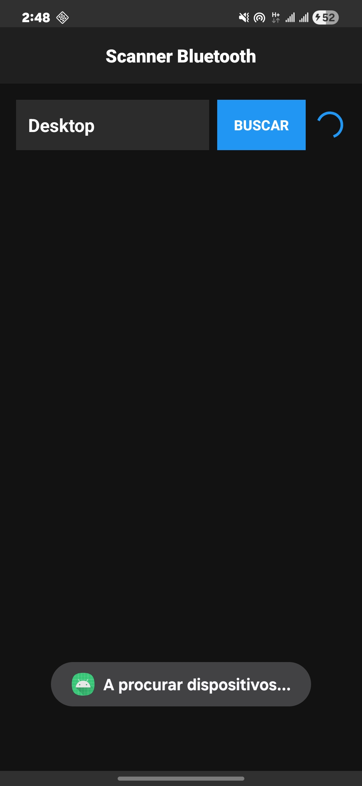
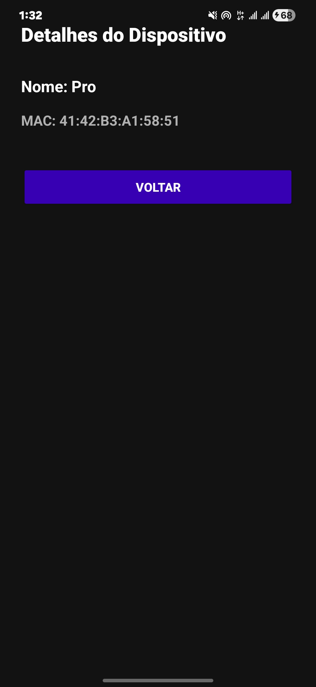

# Especificação Técnica do Projeto - Scanner Bluetooth

## 1. Objetivo da Aplicação
A aplicação tem como objetivo principal permitir a deteção, identificação e análise de dispositivos Bluetooth presentes no raio de alcance do dispositivo móvel. Proporciona uma interface moderna em modo escuro (Dark Theme) para realizar buscas ativas em tempo real, aplicar filtros instantâneos e consultar os detalhes técnicos (Nome e Endereço MAC) de cada dispositivo selecionado.

## 2. Descrição das Funcionalidades
1. **Deteção e Varredura Ativa:** Aciona o adaptador de rede Bluetooth (`BluetoothAdapter`) para efetuar a varredura e rastreio de dispositivos próximos.
2. **Listagem de Dispositivos Pareados:** Carrega e exibe automaticamente os dispositivos previamente associados ao telemóvel ao iniciar a aplicação.
3. **Filtro em Tempo Real:** Campo de texto dinâmico (`EditText` com `TextWatcher`) que filtra instantaneamente os resultados por nome ou endereço MAC.
4. **Notificação de Estado e Conclusão:**
    * Exibe indicador visual de progresso (`ProgressBar`) durante a busca.
    * Emite alertas flutuantes (`Toast`) ao iniciar o escaneamento e um aviso específico quando nenhum novo dispositivo é encontrado.
5. **Navegação para Detalhes:** Seleção de um item da lista para visualização estendida em ecrã secundário.
6. **Gestão de Permissões em Runtime:** Solicitação e verificação de permissões exigidas pelo Android 12+ (`BLUETOOTH_SCAN` e `BLUETOOTH_CONNECT`).

## 3. Descrição das Activities
* **`MainActivity`:** Ecrã principal da aplicação. Contém a barra de topo (`MaterialToolbar`) com o título centralizado, campo de pesquisa/filtro, botão de busca, indicador circular de progresso e a lista (`ListView`) de dispositivos.
* **`DetailActivity`:** Ecrã de detalhes. Recebe os parâmetros do dispositivo selecionado via `Intent Extras` e apresenta o Nome e o Endereço MAC de forma destacada em cartões interativos.

## 4. Forma de Navegação entre as Activities
A navegação ocorre por seleção direta na lista de dispositivos:
1. O utilizador clica num dos itens listados na `ListView` da `MainActivity`.
2. O evento `setOnItemClickListener` valida a permissão de conexão e captura o objeto `BluetoothDevice`.
3. Uma `Intent` explícita é criada direcionada à `DetailActivity`.
4. Os dados são anexados via pares chave-valor (`putExtra("CHAVE_NOME_DISPOSITIVO", ...)` e `putExtra("CHAVE_ENDERECO_MAC", ...)`).
5. A `DetailActivity` recupera os dados e renderiza os campos no ecrã.

## 5. Funcionalidade de Rede Utilizada
* **Rede Sem Fios de Curto Alcance — Bluetooth (IEEE 802.15.1):**
    * Integração com as APIs nativas do Android (`android.bluetooth.BluetoothAdapter` e `android.bluetooth.BluetoothDevice`).
    * Monitorização de eventos via `BroadcastReceiver` tratando as ações `ACTION_DISCOVERY_STARTED`, `ACTION_FOUND` e `ACTION_DISCOVERY_FINISHED`.

## 6. Permissões Necessárias
* `android.permission.BLUETOOTH`: Acesso às funções básicas do rádio Bluetooth.
* `android.permission.BLUETOOTH_ADMIN`: Permissão para iniciar o processo de descoberta (`startDiscovery`).
* `android.permission.BLUETOOTH_SCAN`: Requerida no Android 12+ (API 31+) para varredura de dispositivos próximos (com atributo `neverForLocation`).
* `android.permission.BLUETOOTH_CONNECT`: Requerida no Android 12+ (API 31+) para obter o nome e conectar a dispositivos pareados.
* `android.permission.ACCESS_FINE_LOCATION`: Requerida para varredura Bluetooth em versões do Android 11 ou inferior.

## 7. Informação Relevante para a Execução
* O teste em **dispositivo físico Android** é indispensável para o correto funcionamento da varredura, pois os emuladores padrão não possuem acesso direto ao hardware de rádio Bluetooth do computador.
* As permissões de acesso ao Bluetooth são solicitadas automaticamente na primeira execução da aplicação.

## 8. Evidências da Funcionalidade (Screenshots)

| Ecrã Principal | Filtro de Dispositivos | Detalhes do Dispositivo |
| :---: | :---: | :---: |
|  |  |  |